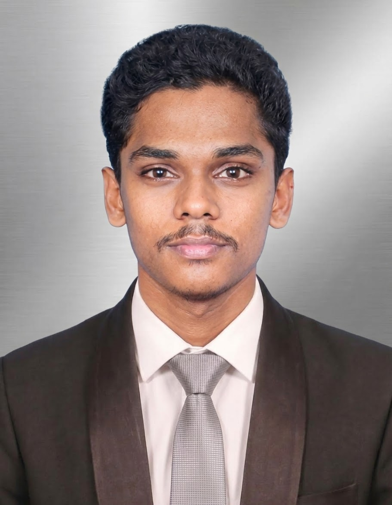

# Abdul Rahman Mohammed Sajan — Specialty Coffee Barista 3D Portfolio



A high-end, 3D interactive, visually stunning personal portfolio website crafted for **Abdul Rahman Mohammed Sajan** (Specialty Coffee Barista).

Built with **Next.js 14 (App Router)**, **TypeScript**, **Tailwind CSS**, **Framer Motion**, and **Three.js / React Three Fiber**.

---

## 🌟 Key Features

- **3D Interactive Coffee Canvas**: Realistic procedural 3D espresso cup model with floating coffee beans and rising particle steam rendered with **Three.js & React Three Fiber**.
- **Interactive Espresso Calibration Simulator**: Real-time barista lab allowing visitors and recruiters to adjust dose weight (g), liquid yield (g), and water brew temperature (°C) to calculate extraction ratios, tasting note profiles, and live status meters.
- **Ambient Web Audio Synthesizer**: Realistic coffee brew sound generator using the browser Web Audio API.
- **Interactive Career Timeline**: Highlighting barista experience at **F-Mart Boutique Supermarket** (Pearl-Qatar, Porto Arabia, Doha) and **Grind** (Colombo, Sri Lanka).
- **Core Competencies & Craft Meters**: Progress indicators for Espresso Extraction, Microfoam Milk Texturing, V60 Manual Pour-overs, HACCP Food Safety, POS & Cash Reconciliation, and Shift Leadership.
- **Multilingual Hospitality Badges**: English (Fluent), Tamil (Native), Sinhala (Conversational).
- **Editable Education Section**: Customizable placeholder section ready for future certifications (SCA / Barista Guild) and academic details.
- **Contact & Recruitment Panel**: Direct WhatsApp integration (`+974 6647 6221`), direct call link, Instagram handle (`@sajanBarista`), location map badges, and client-side golden confetti form celebration.

---

## 🚀 Tech Stack

- **Framework**: Next.js 14+ (App Router)
- **Language**: TypeScript
- **Styling**: Tailwind CSS, Glassmorphism, Luxury Dark Espresso Theme
- **3D & Canvas**: Three.js, `@react-three/fiber`, `@react-three/drei`
- **Animations**: Framer Motion
- **Icons**: Lucide React
- **Effects**: Canvas Confetti

---

## 🛠️ Local Development Setup

1. **Clone the repository**:
   ```bash
   git clone https://github.com/MMMAkees/mohamed_sajan-barista.git
   cd mohamed_sajan-barista
   ```

2. **Install dependencies**:
   ```bash
   npm install --legacy-peer-deps
   ```

3. **Start the local development server**:
   ```bash
   npm run dev
   ```

4. Open [http://localhost:3000](http://localhost:3000) in your browser.

---

## 📬 Contact & Portfolio Owner

- **Barista**: Abdul Rahman Mohammed Sajan
- **Location**: Doha, Qatar
- **Phone / WhatsApp**: +974 6647 6221
- **Email**: sajanmohammed777@gmail.com
- **Instagram**: [@sajanBarista](https://instagram.com/sajanBarista)
